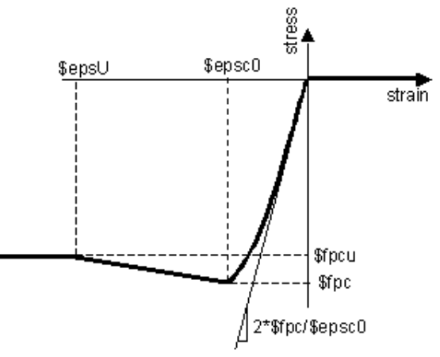

## Concrete01 Material for HSS software

### 1. Properties

fpc: 	concrete maximum compressive strength (double, must be negative)

epsc: 	concrete strain at maximum strength (double, must be negative)

fpcu: 	concrete crushing strength (double, must be negative)

epscu:	concrete strain at crushing strength (double, must be negative)

### 2. Note

* The initial slope (i.e. 'Modulus of Elasticity') for this model is: 2*fpc/epsc.
  $$
  E_{c} = \frac{2\times fpc}{epsc}
  $$

* All properties should be input as negative values. If not, they will be converted to negative automatically.

* This material is developed based on the OpenSees material 'Concrete01'. See more source code at OpenSees Github: https://github.com/OpenSees/OpenSees/blob/master/SRC/material/uniaxial/Concrete01.cpp

### 3. Typical stress-strain relation

