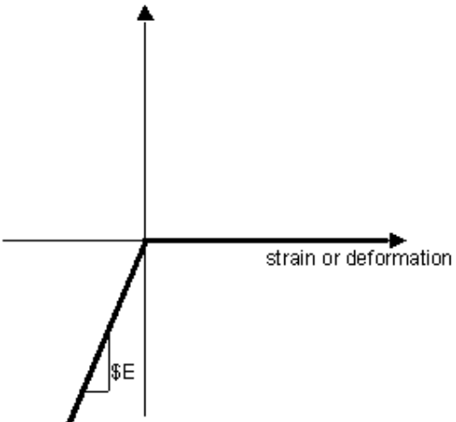

## Elastic-no-tension Material for HSS Software

### 1. Properties

E: 	modulus of elasticity

### 2. Note

This material is developed based on the OpenSees material 'Concrete01'.

See more source code at OpenSees Github: https://github.com/OpenSees/OpenSees/blob/master/SRC/material/uniaxial/Concrete01.cpp 

### 3. Typical stress-strain relation

